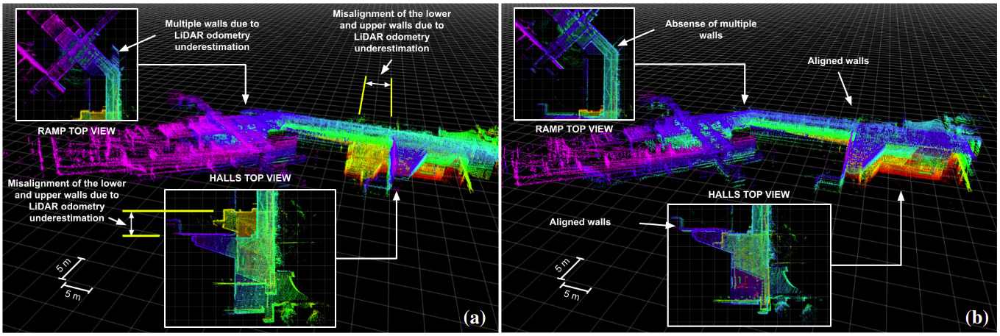
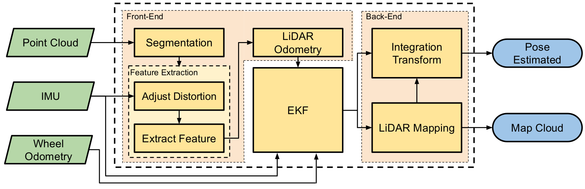

cd # EKF-LOAM

<p style='text-align: justify;'>
EKF-LOAM (Extended Kalman Filter - LiDAR Odometry And Mapping), is an update of the LeGO-LOAM (LightWeight and Ground Optimized - LOAM) algorithm (https://github.com/RobustFieldAutonomyLab/LeGO-LOAM.), designed to handle robot path over/underestimation in environments with few geometric features. This new solution proposes a sensor fusion strategy that merges information from wheel odometry, IMU and LiDAR odometry estimation, which uses an adaptive covariance scheme that is defined according to the number of identified geometric features in the environment.
</p>

<p style='text-align: justify;'>
Below you can see the SLAM some experiment results comparing the two strategies, EKF-LOAM and LeGO-LOAM.
</p>

<p align='center'>
	
</p>
<p align='center'>
	Figure: Mapping results in the Engineering School (UFMG) auditorium hall using: (a) LeGO-LOAM, and (b) EKF-LOAM.
</p>


## The system

<p style='text-align: justify;'> 
The localization and mapping strategy of this package is called EKF-LOAM is an adaptation of the LeGO-LOAM strategy that is a lightweight version of the LOAM method, optimized for ground vehicles, adapted for the EspeleoRobô. This approach is lightweight and therefore allows its execution on embedded computers such as the Nvidia Jetson Nano, providing the odometry at 10 Hz and the map at 2 Hz. According to figure below, the EKF-LOAM has 6 modules: Segmentation, Features Extraction, Adaptive Filter (EKF), LiDAR Odometry, LiDAR Mapping, and Transform Integration. Inputs are the LiDAR raw point cloud and IMU data, while outputs are the robot pose and the environment (point cloud) map. Segmentation, Feature Extraction, LiDAR Odometry, LiDAR Mapping, and Integration Transform.
</p>

<p align='center'>
    
</p>

<p style='text-align: justify;'>
The point cloud of the LiDAR sensor is initially processed in the Pre-Treatment module, where the points are remapped into a range image, the outliers removed, and the data is segmented. In the LiDAR Odometry module, the points are separated into two main sets, one for edge points and the other for points belonging to planes, referred to here as planar points. These features are separated up to a maximum number for edges and planes per range image, discarding the additional features identified in the point cloud. The merged data is introduced between LiDAR SLAM's Back-End and Front-End stages, providing the algorithm with a better estimate of the robot's displacement. Our framework also uses an adaptive covariance scheme for LiDAR odometry, which is defined according to the number of geometric features identified in the environment.
</p>


## Dependency

- [ROS](http://wiki.ros.org/ROS/Installation) (tested with indigo and kinetic)
- [gtsam](https://github.com/borglab/gtsam/releases) (Georgia Tech Smoothing and Mapping library, 4.0.0-alpha2)

```
  wget -O ~/Downloads/gtsam.zip https://github.com/borglab/gtsam/archive/4.0.0-alpha2.zip
  cd ~/Downloads/ && unzip gtsam.zip -d ~/Downloads/
  cd ~/Downloads/gtsam-4.0.0-alpha2/
  mkdir build && cd build
  cmake ..
  sudo make install
```

## Compile

You can use the following commands to download and compile the package.

```
cd ~/catkin_ws/src
git clone https://github.com/ITVRoC/ekf_loam.git
cd ..
catkin_make ekf_loam -j1
```
<p style='text-align: justify;'> 
When you compile the code for the first time, you need to add "-j1" behind "catkin_make" for generating some message types. "-j1" is not needed for future compiling.
</p>

### Note:
<p style='text-align: justify;'>
If you are using Ubuntu 20.04 with ROS Noetic and if you have an error in voxel_grid.h, e.g. Eigen::Index is not a member of Eigen, modify /usr/include/pcl-1.10/pcl/filters/voxel_grid.h at line 340 and line 669.

Original:
</p>

```
for (Eigen::Index ni = 0; ni < relative_coordinates.cols (); ni++)
```
<p style='text-align: justify;'>
Change to:
</p>

```
for (int ni = 0; ni < relative_coordinates.cols (); ni++) 
```

If you have em error in LiDARMapping.cpp, install this package: 
```
sudo apt-get install libparmetis-dev
```

Another possible erro is fix comment the line 21 in the file /usr/include/tbb/task_scheduler_init.h.

```
//#pragma message("TBB Warning: tbb/task_scheduler_init.h is deprecated. For details, please see Deprecated Features appendix in the TBB reference manual.")
```
## Parameters

<p style='text-align: justify;'> 
This package has some configurable parameters, which can be found in the folder:
</p>

```
/EKF_LOAM/Config/ekf_loam_parameters.yaml
/EKF_LOAM/Config/os1_16_parameters.yaml
/adaptive_filter/Config/adaptive_filter_parameters.yaml
```
<p style='text-align: justify;'> 
The parameters of the **ekf_loam_parameters.yaml** package are:
</p>

- Folder to save PCD point cloud
> - `fileDirectoryName`: The folder where the map will be saved.

- Sensor settings
> - `scanPeriod`: Scan Period in seconds;
> - `imuQueLength`: IMU queue length which is its working frequency.

- Filter settings
> - `enableFilter`: Boolean variable that enable the filter in LiDAR SLAM.

- Segmentation settings
> - `sensorMountAngle`: Angle between the horizontal robot plane and the sensor plane;
> - `segmentValidPointNum`: Number of validated points to segmentation step;
> - `segmentValidLineNum`: Number of validated lines to segmentation step;
> - `segmentThetaValue`: Value of the angle theta to segmentation step. Decrese this value may improve accuracy;

- Extract features settings
> - `edgeThreshold`: Edge threshold;
> - `surfThreshold`: Surface threshold;
> - `edgeFeatureMin`: Minimum edge features numbers per subimage;
> - `surfFeatureMin`: Minimum surface features numbers per subimage;
> - `edgeFeatureMax`: Maximum edge features numbers per subimage;
> - `surfFeatureMax`: Maximum surface features numbers per subimage;
> - `cornerDiv`: Division factor of the number of edge points
> - `cornerLessDiv`: Division factor of the number edge points of the smallest group;
> - `surfDiv`: Division factor of the number of surface points
> - `surfLessDiv`: Division factor of the number of surface points of the smallest group.

- Corresponding features settings
> - `nearestFeatureSearchSqDistValue`: Nearest feature search square distance value.

- Loop Clousure settings
> - `enableLoopClosure`: Boolean variable that enable the loop closure.
> - `keyframeRadiuns`: key frame that is within n meters from current pose will be considered for loop closure;
> - `keyframeNum`: 2n+1 number of history key frames will be fused into a submap for loop closure;
> - `keyframeScore`: Key frame score. The smaller the better alignment.

- Mapping settings  
> - `mappingProcessInterval`: Mapping process interval;
> - `surroundingKeyframeSearchRadiusValue`: Key frame that is within n meters from current pose will be considerd for scan-to-map optimization, when loop closure disabled;
> - `surroundingKeyframeSearchNumValue`: Submap size when loop closure enabled;
> - `leafsizemapValue`: Leaf size for KDtree map;
> - `globalMapVisualizationSearchRadiusValue`:Key frames with in n meters will be visualized.

<p style='text-align: justify;'> 
The parameters of the **os1_16_parameters.yaml** package are:
</p>

- Sensor settings
> - `V_SCAN`: Number of vertical scan of the sensor;
> - `H_SCAN`: Horizontal resolution of the sensor;
> - `groundScanInd`: Vertical subdivision for the ground plane search;
> - `opening_vertical_angle`: Opening vertical angle;
> - `opening_horizon_angle`: Opening horizontal angle;
> - `start_angle_v`: Bottom vertical angle;
> - `start_angle_h`: First horizontal angle, considering the range [-180,180].

<p style='text-align: justify;'> 
The parameters of the **adaptive_filter_parameters.yaml** package are:
</p>

- Filter settings
> - `enableImu`: Booleqan variable that enable the IMU in the filter;
> - `enableWheel`: Booleqan variable that enable the Wheel Odometry in the filter;
> - `enableLidar`: Booleqan variable that enable the LiDAR Odometry in the filter;
> - `filterFreq`: Char variable that you select the output frequency. Write 'i' for IMU frequency, 'w' for the wheel odometry frequency and 'l' for LiDAR odometry frequency.

## Run the package

To run online experiments:

1. Run the package of LiDAR:
```
roslaunch ouster_ros ouster_os1.launch
```

2. Run the launch file:
```
roslaunch ekf_loam ekf_loam.launch
```

To run in simulation:

1. Change the argument "sim" in the launch file to true:
```
<arg name = "sim" value = "true" />
```
2. Run the launch file:
```
roslaunch ekf_loam ekf_loam.launch
```

To run offline in bag files:

1. Run the launch file:
```
roslaunch ekf_loam espeleo_lego_loam.launch
```

2. Play existing bag files:
```
rosbag play *.bag --clock --topic /os1_cloud_node/points /imu/data /odom
```

## Datasets

<p style='text-align: justify;'> 
To test and train the use of the EKF-LOAM package with or without the filter, a set of 6 datasets of some experiments carried out with EspeleoRobô were made available in the [ITV repository](https://drive.google.com/drive/folders/18292dt871h_fiKc7Sc-kdcUcxJtLSDtw?usp=sharing), as listed below:
</p>

- `control_in_square.bag`: Upper Auditorium of the UFMG School of Engineering;
- `indoor_follow_wall.bag`: Upper inner courtyard of the UFMG School of Engineering;
- `two_levels_indoor.bag`: Upper and lower auditorium of the UFMG School of Engineering;
- `outdoor_rectangle.bag`: Close to the UFMG School Restaurant;
- `mina_du_veloso.bag`: Mina du Veloso in the city of Ouro Preto, Brazil;
- `tunnel_sabara.bag`: Deactivated tunnel in the city of Sabará, Brazil.


<p style='text-align: justify;'> 
Each dataset contains data from the LiLDAR sensor (including the point cloud and the internal IMU), the XSense IMU, the angular velocities of each robot wheel and the online wheel odometry. The list of ROS topics included in each dataset is shown below:
</p>

- `/device1/get_joint_state`: Angular and linear speeds of the EspeleoRobô wheel 1;
- `/device2/get_joint_state`: Angular and linear speeds of the EspeleoRobô wheel 2;
- `/device3/get_joint_state`: Angular and linear speeds of the EspeleoRobô wheel 3;
- `/device4/get_joint_state` : Angular and linear speeds of the EspeleoRobô wheel 4;
- `/device5/get_joint_state`: Angular and linear speeds of the EspeleoRobô wheel 5; 
- `/device6/get_joint_state`: Angular and linear speeds of the EspeleoRobô wheel 6; 
- `/imu/data`: XSense IMU data;
- `/odom`: Wheel Odometry performed online on the robot;
- `/os1_cloud_node/points`: LiDAR sensor point cloud;
- `/os1_cloud_node/imu`: LiDAR sensor internal IMU data.

<p style='text-align: justify;'> 
The figure below shows the maps generated with the LiDAR SLAM technique for each of the datasets.
</p>

<p align='center'>
    
</p>

<p align='center'> 
Figure: Maps generated for each of the datasets.
</p>

## Report a Bug

To report a bug, send email to gilmarpcruzjunior@gmail.com.

